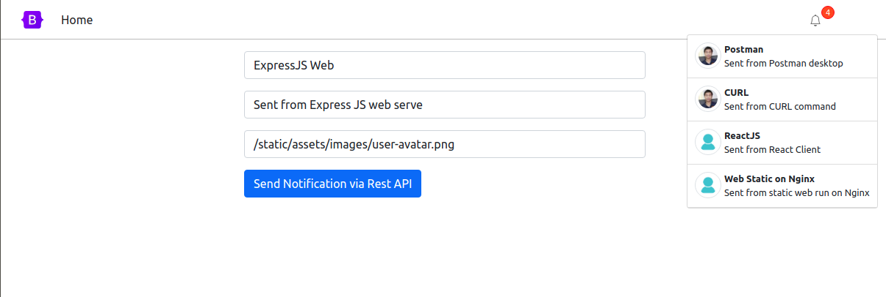

# SocketIO, Nodejs send realtime Notification via RestAPI

**Features**

1. [x] Realtime notification server with SocketIO.
2. [x] Send realtime notification via RestAPI (Postman, CURL, etc).
3. [x] Apply realtime websocket in a ReactJS client.
4. [ ] Apply realtime websocket in a Angular client.

**Screenshot**



## Quickstart

Easy to start this project with Docker compose.

```shell
docker-compose up -d

# OR
make start
```

## Testing

Let test send notification via API with theses way:

**CURL**

```shell

# Send to all clients 
curl --location --request POST 'http://localhost:3099/notifications' \
--header 'Content-Type: application/json' \
--data-raw '{
    "title": "CURL",
    "message": "Sent from CURL command",
    "icon": "https://avatars.githubusercontent.com/u/46224928?s=60&v=4"
}'

# Send private message to a special client by socket id
curl --location --request POST 'http://localhost:3099/notifications' \
--header 'Content-Type: application/json' \
--data-raw '{
    "title": "For User1 only",
    "message": "Sent private message for user with user_id=1 only",
    "icon": "https://avatars.githubusercontent.com/u/46224928?s=60&v=4",
    "user_id": 1
}' 
```

**Postman**

```shell
# POST - http://localhost:3099/notifications

# Body

# {
#     "title": "Postman",
#     "message": "Sent from Postman desktop",
#     "icon": "https://avatars.githubusercontent.com/u/46224928?s=60&v=4"
# }

```


## Reference

- https://socket.io/docs/v4/
- https://socket.io/get-started/chat
