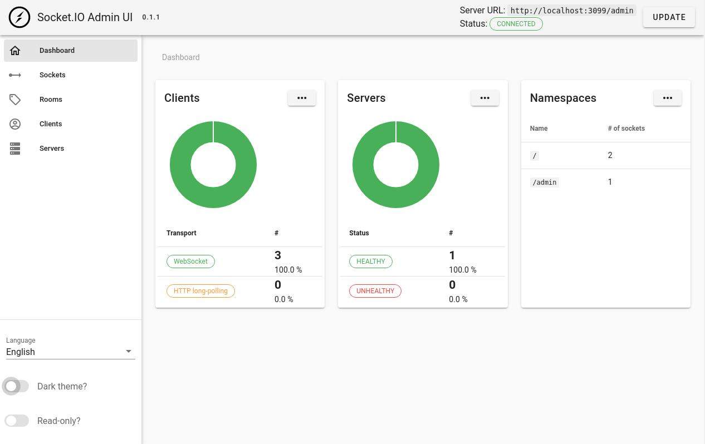

# SocketIO Admin UI

The Socket.IO admin UI can be used to have an overview of the state of your Socket.IO deployment.

The source code can be found here: https://github.com/socketio/socket.io-admin-ui/




## Quickstart

We use SocketIO Admin UI v0.1.1 release version.

The source code can be found here: https://github.com/socketio/socket.io-admin-ui/releases/tag/0.1.1

**Connect to a SocketIO Server**

Login with this info:

```
Server URL: http://localhost:3099/admin
Username: admin
Password: **************
```

## Reference

- https://socket.io/docs/v4/admin-ui/


